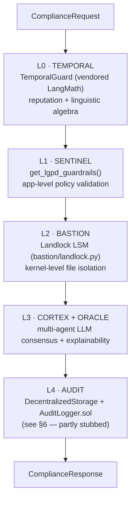
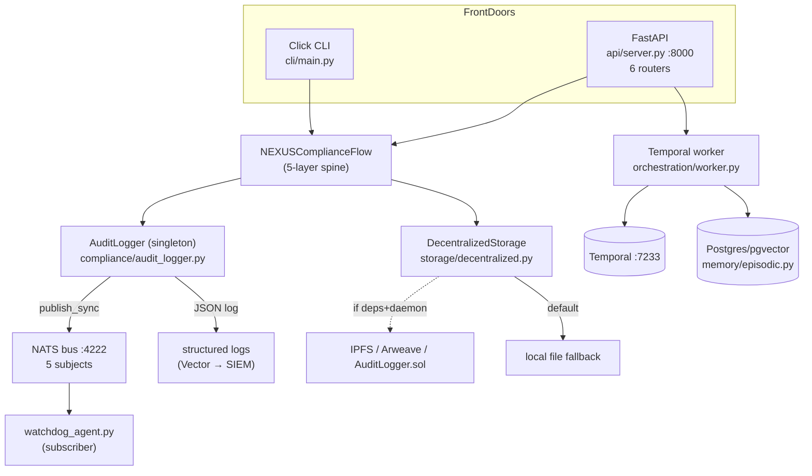

# Neotron — Architecture Map (day-one view)

> **Purpose**: onboarding map of what neotron *actually is today*, after LangMath, IP-Guard and
> phantom-soc-kernel were extracted to their own repos. Visual-first, ~5 min read. For the forensic
> "claims vs. reality" audit, see [`SPEC.md`](SPEC.md). Every box/edge below points to a real file.
> _Updated: 2026-06-23._

---

## TL;DR

Neotron (package `neutron-nexus`, branded **NEXUS**) is a **Python 3.13 compliance-orchestration
platform**. Its heart is a single object — `NEXUSComplianceFlow` — that runs every request through
**5 stacked guard layers** (temporal → app → kernel → multi-agent → audit). Around that core sit two
front doors (a **Click CLI** and a **FastAPI** server), a **Temporal** worker for long jobs, a **NATS**
event bus (5 subjects), and **Postgres/pgvector** for memory. The architecture feels "invisible"
because almost everything is **lazy-loaded** — it only materializes at runtime, not in the file tree.

---

## 1. The mental model: the 5-layer spine

Everything else is plumbing around this. Source: `neutron/compliance/nexus_flow.py` (class
`NEXUSComplianceFlow`).

| Layer | What it does | Wired by | Status |
|-------|--------------|----------|--------|
| L0 TEMPORAL | Temporal reputation + critical-discourse analysis | `_get_temporal_guard()` → `TemporalGuard` (`compliance/temporal_guard.py`) | ✅ real, vendored under `neutron.langmath` |
| L1 SENTINEL | LGPD/GDPR/AI-Act guardrails | `_get_sentinel()` → `get_lgpd_guardrails()` | ✅ real (`compliance/auditors/*`) |
| L2 BASTION | Kernel file isolation | `bastion/landlock.py`, `namespaces.py` | ✅ real (Landlock, **not** seccomp) |
| L3 CORTEX+ORACLE | Multi-agent LLM + explanation | `_get_cortex_swarm()`, `_get_oracle()` | ✅ wired (LLM via `ml-offload` HTTP) |
| L4 AUDIT | Immutable trail (IPFS/Arweave/on-chain) | `_get_storage()` → `DecentralizedStorage` | ⚠️ **fallback-to-local** (see §6) |

> **Key trait:** every layer is **lazy-loaded** (`self._sentinel = None` + `_get_*()`), and each is
> independently toggleable (`enable_temporal`, `enable_bastion`, `enable_smart_contracts=False` by
> default). This is *why* the architecture is invisible at rest — it assembles itself on first call.

---

## 2. Runtime topology

How a real request/job flows through the system.

**Front doors** — `neutron/cli/main.py` (Click groups: `infra`, `worker`, `demo`, `run`, `test`,
`check`, `cost`) and `neutron/api/server.py` (routers: `auth`, `policy`, `audit`, `consent`,
`compliance`, `oracle`).
**Workhorse** — `orchestration/worker.py`: `AgentCoordinationWorkflow` with activities
`run_agent_swarm` + `store_memory_episode`; plus `defi_workflow.py`.

---

## 3. Module map

`neutron/<dir>` → role and who it talks to (edges = real internal imports).

| Module | Role | Talks to (internal) | Status |
|--------|------|---------------------|--------|
| `compliance/` | **The hub** — 5-layer flow, auditors, audit logger, NATS events | langmath, memory, orchestration, reasoning, spectre, storage | ✅ core |
| `api/` | FastAPI control plane (6 routers, stores) | agents, compliance, core, reasoning, storage | ✅ |
| `orchestration/` | Temporal worker + workflows | agents, compliance, defi, events, memory, reasoning | ✅ |
| `agents/` | Agent defs + LLM HTTP client (`ml-offload`) | compliance, orchestration | ✅ |
| `bastion/` | Landlock kernel isolation | compliance | ✅ |
| `events/` | NATS pub/sub helpers + JetStream | — (leaf) | ✅ |
| `langmath/` | Vendored LangMath (L0 brains) | compliance | ✅ vendored |
| `siem/` | CEF/JSON/Syslog exporters | compliance | ✅ |
| `defi/` | DeFi monitor (eth RPC) | events, orchestration | ✅ |
| `spectre/` | HTTP client to SPECTRE proxy (JWT + circuit breaker) | — | ✅ |
| `memory/` | Episodic memory (pgvector) | — | ✅ |
| `reasoning/` | Oracle / ensemble reasoning | — | ✅ |
| `security/` | Git secret scanner | — | ✅ |
| `license/` | License verify via external `ip-guard` binary (PATH) | events | ✅ (binary now external) |
| `core/` | Config / settings | — | ✅ |
| `storage/` | DecentralizedStorage (IPFS/Arweave + local) | — | ⚠️ see §6 |

---

## 4. Event topology (NATS, 5 subjects)

All subjects are `v1`-versioned and namespaced (`events/__init__.py:_ns`). Helpers:
`emit_sentinel/bastion/cortex/violation`. Subscriber: `compliance/watchdog_agent.py`.

| Subject | Published by | Consumed by |
|---------|--------------|-------------|
| `neotron.compliance.sentinel.v1` | `audit_logger.log()` (sync), `emit_sentinel` | watchdog_agent |
| `neotron.compliance.bastion.v1` | `emit_bastion` | watchdog_agent |
| `neotron.compliance.violation.v1` | `emit_violation` | watchdog_agent |
| `neotron.cortex.consensus.v1` | `emit_cortex` (L3) | watchdog_agent |
| `neotron.siem.export.v1` | `siem/` exporters | external SIEM (Wazuh/Splunk/Owasaka) |

---

## 5. Data layer

| Store | Used by | Reality |
|-------|---------|---------|
| **PostgreSQL / pgvector** | `memory/episodic.py` (`create_engine`), `core/config.py` | ✅ real (also CI `pgvector/pgvector:pg15`) |
| **ChromaDB** | `langmath/core/rag.py` | ✅ for vendored RAG helpers |
| **Audit log (in-memory)** | `compliance/audit_logger.py` | ⚠️ singleton list, `.clear()`-able — **volatile** |
| **IPFS / Arweave / on-chain** | `storage/decentralized.py` | ⚠️ fallback-to-local (deps undeclared) |

---

## 6. The "invisible" architecture (read this part)

Things that don't show up by browsing folders — and that matter:

1. **It's lazy-loaded end to end.** `NEXUSComplianceFlow` holds `None`s until `_get_*()` runs. The
   real shape only exists at runtime → that's why it "felt invisible."
2. **Dependency cycles.** `compliance ↔ orchestration`, `compliance ↔ langmath`,
   `agents ↔ orchestration`. `compliance` is a god-hub (39 inbound imports). Refactor-sensitive.
3. **Audit is volatile, but not silent.** `AuditLogger` keeps an **in-memory list** (lost on
   restart), yet *also* emits structured JSON (Vector → SIEM) and publishes to NATS `sentinel.v1`.
   So there's a trail — it just **isn't tamper-evident or queryable after restart**. This is the
   real "verifiability hole."
4. **Layer 4 is the weakest link.** `enable_smart_contracts=False` by default; `DecentralizedStorage`
   falls back to local files because `ipfshttpclient`/`ar` aren't declared deps. `AuditLogger.sol`
   exists on-chain but nothing wires the Python audit to it.
5. **Broken entry points.** `pyproject.toml` scripts `neutron-gui` and `neutron-dag` point to
   modules that don't exist (`neutron/gui`, `neutron/integration`).

---

## 7. How to run it

| Goal | Command |
|------|---------|
| Bring up infra (Postgres, Temporal) | `just infra-up` / `make start-infra` |
| Start Temporal worker | `just worker` (entry: `neutron-worker`) |
| Start API | `neutron serve` → FastAPI on `:8000` (`/docs`) |
| Run unit tests (no infra) | `just test` (`pytest -m 'not integration'`) |
| Coverage | `just test-coverage` (`--cov`, writes `htmlcov/`) |
| Lint / format / types | `just lint` · `just fmt` · `just typecheck` |

**Real entry points:** `neutron` (`cli/main.py:main`), `neutron-worker`
(`orchestration/worker.py:main`). _(Ignore `neutron-gui` / `neutron-dag` — broken, see §6.)_
