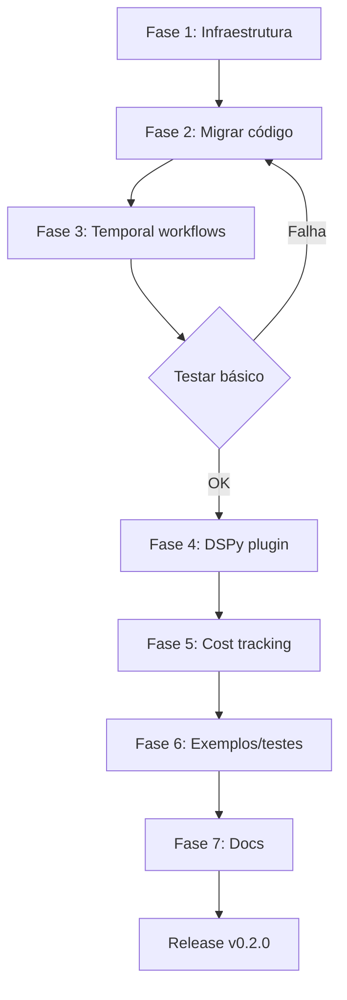

# Plano de Integração: Agentic-Core → Neutron

## Objetivo
Integrar o código DSPy + Ensemble Reasoning do agentic-core ao neutron real, criando um sistema híbrido que combina:
- **Neutron existente**: Hyperparameter optimization com Temporal + Ray + MLflow
- **Agentic-core**: DSPy prompt optimization + LLM ensemble reasoning

## Arquitetura Proposta

```
neutron/
├── agentic/                     [NOVO]
│   ├── __init__.py
│   ├── dspy_adapter.py         # Adapter DSPy para multi-provider
│   ├── ensemble_reasoning.py   # LLM ensemble com voting strategies
│   ├── cognitive_patterns.py   # CoT, Reflexion, ToT patterns
│   └── workflows.py            # Temporal workflows específicos para LLM tasks
├── gui/
│   └── ...
└── __init__.py
```

## Fases de Integração

### Fase 1: Preparação de Infraestrutura ✓
**Status**: Planejamento
**Duração estimada**: 1-2 horas

**Tarefas**:
- [x] Mapear estrutura atual de ambos repos
- [ ] Criar diretório `neutron/agentic/`
- [ ] Adicionar dependências DSPy ao pyproject.toml
- [ ] Atualizar .gitignore se necessário

**Dependências a adicionar**:
```toml
[project]
dependencies = [
    # ... existing deps ...
    "dspy-ai>=2.4.0",
    "openai>=1.12.0",
    "aiohttp>=3.9.0",
]
```

### Fase 2: Migração de Código Base
**Status**: Pendente
**Duração estimada**: 2-3 horas

**Arquivos a migrar** (de `/home/kernelcore/dev/low-level/agentic-core/`):

1. **dspy_adapter.py** → `neutron/agentic/dspy_adapter.py`
   - Adaptar imports para estrutura neutron
   - Garantir compatibilidade com providers (DeepSeek, OpenAI, llama.cpp)
   - Integrar com sistema de logging do neutron

2. **ensemble_reasoning.py** → `neutron/agentic/ensemble_reasoning.py`
   - Adaptar para usar MLflow tracking do neutron
   - Integrar com cost_tracker.py para rastreamento de custos LLM
   - Manter estratégias: majority, confidence_weighted, best_of_n, unanimous

3. **Criar cognitive_patterns.py** (novo)
   - Implementar Chain-of-Thought, Reflexion, Tree-of-Thoughts
   - Basear-se nos padrões do brainstorming plan

### Fase 3: Integração com Temporal Workflows
**Status**: Pendente
**Duração estimada**: 3-4 horas

**Criar** `neutron/agentic/workflows.py`:

```python
from temporalio import workflow, activity
from .ensemble_reasoning import EnsembleReasoner
from .dspy_adapter import DSPyProviderAdapter

@workflow.defn(name="LLMEnsembleWorkflow")
class LLMEnsembleWorkflow:
    """Workflow para ensemble de LLMs (diferente do ensemble de modelos ML)"""

    @workflow.run
    async def run(self, task: str, providers: List[str], strategy: str) -> EnsembleResult:
        # Executar ensemble reasoning com retry/fallback via Temporal
        pass

@workflow.defn(name="PromptOptimizationWorkflow")
class PromptOptimizationWorkflow:
    """Workflow para otimizar prompts usando DSPy MIPRO"""

    @workflow.run
    async def run(self, task_signature: str, eval_dataset: List[dict]) -> str:
        # Usar DSPy bootstrap para otimizar prompts
        pass
```

**Integração com workflows.py existente**:
- Adicionar imports dos novos workflows
- Registrar no worker.py

### Fase 4: Plugin DSPy para Optimizer
**Status**: Pendente
**Duração estimada**: 4-5 horas

**Objetivo**: Fazer DSPy funcionar como OptimizerPlugin no optimizer.py

```python
# Em neutron/agentic/dspy_optimizer_plugin.py
class DSPyOptimizerPlugin:
    """Plugin que usa DSPy para otimizar hiperparâmetros via prompts"""

    def suggest_configs(self, num: int, state: OptimizationState,
                       experiment_id: str) -> List[TrainingConfig]:
        # Usar LLM ensemble para sugerir configurações inteligentes
        # baseado em histórico de runs anteriores
        pass

    def update_from_results(self, results: List[TrainingResult]) -> None:
        # Aprender com resultados via DSPy optimization
        pass
```

**Integração com optimizer.py**:
- Registrar como strategy "DSPY" em SearchStrategy enum
- Adicionar à factory em `_create_optimizer()`

### Fase 5: Integração com Cost Tracking
**Status**: Pendente
**Duração estimada**: 2 horas

**Modificar** `cost_tracker.py`:
- Adicionar tracking de custos LLM (tokens, chamadas API)
- Integrar com CEREBRO para orçamento de LLM calls

```python
# Adicionar ao CostTracker
def track_llm_inference(
    self,
    provider: str,
    tokens_input: int,
    tokens_output: int,
    model: str,
) -> None:
    """Track LLM API costs"""
    cost = self._calculate_llm_cost(provider, tokens_input, tokens_output, model)
    # Log to MLflow + PostgreSQL
```

### Fase 6: Exemplos e Testes
**Status**: Pendente
**Duração estimada**: 2-3 horas

**Criar** `examples/` no neutron com:
1. `agentic_ensemble_demo.py` - Demonstrar LLM ensemble
2. `dspy_prompt_optimization.py` - Otimizar prompts com DSPy
3. `hybrid_ml_llm_pipeline.py` - ML training + LLM reasoning combinados

**Testes**:
- Migrar `test_llamacpp.py` para `tests/test_agentic_dspy.py`
- Adicionar testes de integração com Temporal
- Testar cost tracking end-to-end

### Fase 7: Documentação
**Status**: Pendente
**Duração estimada**: 1-2 horas

- Atualizar README.md com seção "Agentic LLM Features"
- Criar QUICKSTART_AGENTIC.md (baseado no QUICKSTART_LLAMACPP.md)
- Documentar novos workflows no TODO.md

## Pontos de Integração Chave

### 1. MLflow Integration
**Neutron existente**:
```python
mlflow.log_params({...})
mlflow.log_metrics({...})
```

**Agentic-core**:
```python
# ensemble_reasoning.py já tem estrutura para tracking
# Adaptar para usar MLflow client do neutron
```

### 2. Temporal Workflows
**Neutron existente**:
- `HyperparameterOptimizationWorkflow`
- `EnsembleTrainingWorkflow` (ML models)

**Novo**:
- `LLMEnsembleWorkflow` (LLM reasoning)
- `PromptOptimizationWorkflow` (DSPy optimization)

### 3. Cost Tracking
**Neutron existente**: GCP CEREBRO integration
**Novo**: LLM API cost tracking (DeepSeek $0.0001/token, GPT-4 $0.03/token)

## Diferenças Críticas

### Ensemble no Neutron vs Agentic-Core

**Neutron `EnsembleTrainingWorkflow`**:
- Treina N modelos ML com seeds diferentes
- Ensemble de **modelos treinados** (ML)
- Foco: generalização, robustez

**Agentic `LLMEnsembleWorkflow`**:
- Executa N LLMs em paralelo
- Ensemble de **respostas** via voting
- Foco: accuracy, multi-provider resilience

**São complementares!** Pode-se usar ambos:
1. Treinar ensemble de modelos ML (neutron)
2. Usar LLM ensemble para meta-análise dos resultados (agentic)

## Fluxo de Integração Recomendado



## Comandos de Execução

```bash
# 1. Preparar ambiente
cd /home/kernelcore/arch/neutron
uv sync --all-extras  # Após adicionar deps DSPy

# 2. Testar DSPy adapter
python -c "from neutron.agentic import DSPyProviderAdapter; print('OK')"

# 3. Rodar exemplo básico
python examples/agentic_ensemble_demo.py

# 4. Testar workflow
python -m temporal workflow start \
  --task-queue neutron-tasks \
  --workflow-type LLMEnsembleWorkflow \
  --input '{"task": "What is 2+2?", "providers": ["deepseek", "local"]}'

# 5. Verificar custos
python -c "from cost_tracker import CostTracker; CostTracker().report_llm_costs()"
```

## Riscos e Mitigações

| Risco | Impacto | Mitigação |
|-------|---------|-----------|
| Conflito de dependências (DSPy vs Torch) | Alto | Testar em venv isolado primeiro |
| Latência de LLM afeta workflows | Médio | Usar timeouts agressivos, fallback rápido |
| Custos LLM não rastreados | Alto | Integrar cost tracking ANTES de produção |
| Poetry/UV lock issues | Médio | Usar `uv sync --no-cache` se necessário |

## Critérios de Sucesso

### MVP (Minimum Viable Product)
- [ ] DSPy adapter funciona com 3 providers (DeepSeek, OpenAI, llama.cpp)
- [ ] Ensemble reasoning executa com 2 estratégias (majority, confidence_weighted)
- [ ] 1 Temporal workflow funcional (`LLMEnsembleWorkflow`)
- [ ] Cost tracking registra custos LLM no MLflow
- [ ] 1 exemplo end-to-end funcional

### Full Integration
- [ ] Todos 4 voting strategies implementados
- [ ] DSPy como OptimizerPlugin registrado
- [ ] Cognitive patterns (CoT, Reflexion) funcionais
- [ ] 3+ exemplos completos
- [ ] Tests coverage > 70%
- [ ] Documentação completa

## Timeline Estimado

- **Fase 1**: 1-2h
- **Fase 2**: 2-3h
- **Fase 3**: 3-4h
- **Fase 4**: 4-5h
- **Fase 5**: 2h
- **Fase 6**: 2-3h
- **Fase 7**: 1-2h

**Total**: 15-21 horas de desenvolvimento

**MVP Timeline**: Fases 1-3 + testes básicos = ~8-10 horas

## Próximos Passos Imediatos

1. Criar estrutura de diretórios `neutron/agentic/`
2. Adicionar dependências DSPy ao pyproject.toml
3. Copiar e adaptar dspy_adapter.py
4. Testar imports e compatibilidade
5. Migrar ensemble_reasoning.py
6. Criar primeiro workflow de exemplo

---

**Nota**: Este plano assume que ambos repos (`agentic-core` e `arch/neutron`) estão sincronizados e acessíveis. Ajustar conforme evolução do desenvolvimento.
