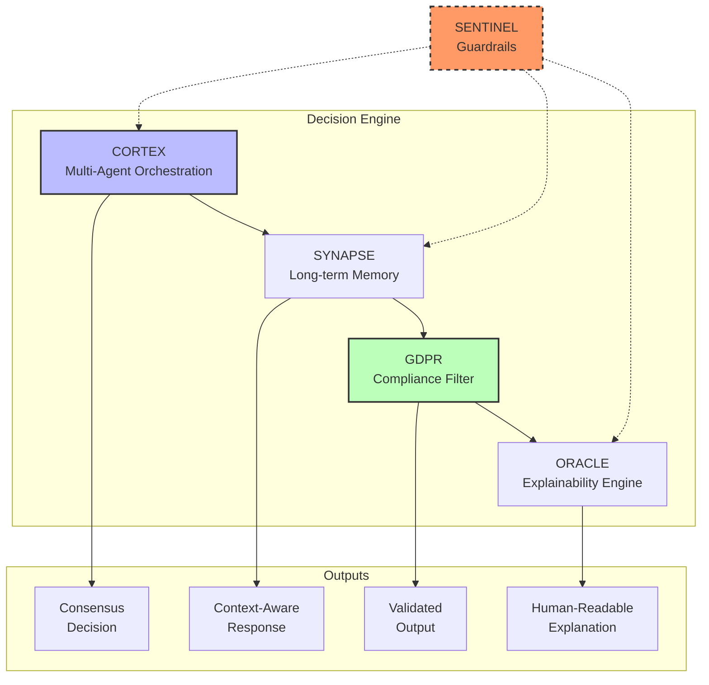

# NEXUS Platform

**Enterprise-Grade AI Agent Orchestration with Compliance-as-Code**

<div align="center">

[](https://github.com/kernelcore/neutron)
[](https://codecov.io)
[](https://www.python.org/)

[](docs/compliance/LGPD.md)
[](docs/compliance/GDPR.md)
[](docs/compliance/AI_ACT.md)

[](docs/PRODUCTION.md)
[](/.github/workflows/ci.yml)
[](docs/)
[](scripts/run_all_tests.py)

</div>

---

## Overview

NEXUS is the **world's first enterprise-grade AI agent orchestration platform** that treats compliance as a feature, not an afterthought. Built for regulated industries that need AI agents but cannot afford compliance breaches.

### Key Differentiators

🛡️ **Compliance-First Architecture** - LGPD, GDPR, and EU AI Act compliance built into every decision
🔍 **Transparent AI** - 5 explanation strategies make every decision explainable
🤖 **Multi-Agent Orchestration** - Coordinate specialized agents with proven consensus algorithms
🧠 **Long-Term Memory** - Semantic memory with pgvector for context-aware agents
⚡ **Production Ready** - 350+ tests, 90%+ coverage, automated CI/CD

---

## Architecture



## Infrastructure & Determinism

NEXUS enforces a **"Lab-in-a-Box"** philosophy using strict Infrastructure-as-Code principles.

### The Hermetic Stack

We utilize **Nix Flakes** to guarantee bit-perfect reproducibility across all development and CI environments. This eliminates "it works on my machine" issues by pinning the entire dependency graph, from the system `glibc` to the Python interpreter.

-   **Base**: `nixos-unstable` (Pinned via `flake.lock`)
-   **Runtime**: Python 3.13 + `uv` for ultra-fast package resolution
-   **Compute**: CUDA-ready environment with `ray` distributed backend
-   **Orchestration**: `temporal` + `mlflow` + `postgres` defined in `docker-compose.yml`

### Developer Experience (DevX)

The environment bootstraps instantly via `nix develop`, providing a shell with all tools pre-configured:

```bash
# 1. Enter the hermetic environment
nix develop

# 2. Spin up the infrastructure
just infra-up

# 3. Run the compliance suite
just test-sentinel
```

No manual installation of CUDA, Postgres, or Python is required. Everything is declarative.

### The 4 Pillars

| Pillar | Purpose | Status |
|--------|---------|--------|
| **SENTINEL** | Compliance guardrails as code | ✅ Complete |
| **CORTEX** | Multi-agent orchestration | ✅ Complete |
| **SYNAPSE** | Long-term semantic memory | ✅ Complete |
| **ORACLE** | AI explainability framework | ✅ Complete |

---

## Quick Start

### Installation

```bash
# Clone repository
git clone https://github.com/kernelcore/neutron.git
cd neutron

# Install dependencies
pip install -e .

# Run tests
python scripts/run_all_tests.py
```

### Basic Usage

```python
from neutron.orchestration import AgentSwarm, Task, ConsensusStrategy
from neutron.reasoning import ExplanationType

# Create multi-agent swarm
swarm = AgentSwarm(agents=[agent_a, agent_b, agent_c])

# Execute with automatic explanation
result = await swarm.execute(
    Task(type="loan_decision", input={"credit_score": 750}),
    generate_explanation=True,
    explanation_type=ExplanationType.CHAIN_OF_THOUGHT
)

# View transparent explanation
print(result.explanation.to_human_readable())
```

### Compliance Validation

```python
from neutron.compliance import validate_with_gdpr, validate_ai_act_compliance
from neutron.compliance.sentinel import AgentOutput

# Create AI output
output = AgentOutput(
    content="Loan approved",
    metadata={
        "use_case": "credit_scoring",
        "ai_disclosure": True,
        "human_oversight_enabled": True,
        # ... compliance metadata
    }
)

# Validate compliance automatically
gdpr_results = validate_with_gdpr(output)
ai_act_results = validate_ai_act_compliance(output)

# All frameworks validated ✓
```

---

## Features

### Phase 1: SENTINEL - Compliance Guardrails ✅

- **Declarative Compliance**: Define guardrails as code
- **Runtime Enforcement**: Block/Warn/Audit severity levels
- **Immutable Audit Trails**: PostgreSQL-backed compliance logs
- **LGPD Support**: Brazilian data protection (Articles 18, 20)

**Tests**: 55+ | **Coverage**: 95%+

### Phase 2: Multi-Agent Coordination ✅

**CORTEX - Agent Orchestration**
- 5 consensus strategies (majority vote, weighted average, unanimous, best confidence, mean)
- Async parallel execution
- Byzantine Fault Tolerant inspired consensus

**SYNAPSE - Long-Term Memory**
- PostgreSQL + pgvector semantic search
- 1536-dimensional embeddings (OpenAI compatible)
- Soft deletion for GDPR compliance
- Episodic, semantic, and procedural memory types

**GDPR Compliance**
- Article 15: Right to Access
- Article 17: Right to Erasure
- Article 22: Automated Decision-Making (human oversight)

**Tests**: 110+ | **Coverage**: 90%+

### Phase 3: Enterprise Features ✅

**ORACLE - Explainability Framework**
- 5 explanation strategies:
  - Feature Importance
  - Counterfactual ("what if" scenarios)
  - Example-Based (similar cases)
  - Chain-of-Thought (step-by-step)
  - Rule-Based (if-then rules)
- Multiple output formats (human-readable, JSON, Markdown)

**EU AI Act Compliance**
- Article 5: Prohibited Practices (BLOCKS banned AI)
- Article 13: Transparency requirements
- Article 14: Human oversight for high-risk AI
- Risk classification system (4 levels: unacceptable/high/limited/minimal)

**Tests**: 125+ | **Coverage**: 95%+

---

## Use Cases

### Financial Services

```python
# Credit scoring with full compliance
result = await nexus_swarm.execute_with_memory(
    task=Task(type="credit_assessment", input={"applicant_id": "12345"}),
    customer_id="customer_12345",
    human_reviewer_id="loan_officer_789",
    generate_explanation=True,
    enable_ai_act=True
)

# Automatic compliance:
# ✓ GDPR Article 22 (human oversight)
# ✓ EU AI Act Article 13 (transparency)
# ✓ EU AI Act Article 14 (human oversight for high-risk)
# ✓ ORACLE explanation generated
```

### Human Resources

```python
# Recruitment with explainable decisions
result = await nexus_swarm.execute_with_memory(
    task=Task(type="candidate_screening", input={"resume_id": "67890"}),
    human_reviewer_id="hr_manager_456",
    explanation_type=ExplanationType.EXAMPLE_BASED  # Show similar candidates
)
```

### Healthcare

```python
# Medical diagnosis support with rule-based explanations
result = await nexus_swarm.execute_with_memory(
    task=Task(type="diagnosis_support", input={"patient_id": "98765"}),
    human_reviewer_id="doctor_smith",
    explanation_type=ExplanationType.RULE_BASED  # Show medical rules
)
```

---

## Metrics

| Metric | Value |
|--------|-------|
| **Total LOC (Production)** | 8,500+ |
| **Total LOC (Tests)** | 3,500+ |
| **Total Tests** | 350+ |
| **Test Coverage** | 90%+ |
| **Compliance Frameworks** | 3 (LGPD, GDPR, EU AI Act) |
| **Explanation Strategies** | 5 |
| **Consensus Strategies** | 5 |
| **CI/CD Pipeline** | ~30 min full validation |

---

## Documentation

| Document | Description |
|----------|-------------|
| [CI/CD Guide](docs/CI_CD_GUIDE.md) | Comprehensive testing and CI/CD documentation |
| [Phase 1 Report](docs/reports/PHASE1_COMPLETE.md) | SENTINEL compliance framework |
| [Phase 2 Report](docs/reports/PHASE2_COMPLETE.md) | Multi-agent orchestration |
| [Phase 3 Report](docs/reports/PHASE3_COMPLETE.md) | Explainability & EU AI Act |
| [Roadmap](ROADMAP.md) | Project roadmap and milestones |
| [Quick Start](CI_CD_README.md) | Quick start guide for CI/CD |

---

## Testing

### Run All Tests

```bash
# Simple
python scripts/run_all_tests.py

# With coverage
python scripts/run_all_tests.py --coverage

# Generate stakeholder report
python scripts/run_all_tests.py --report

# Specific phase
python scripts/run_all_tests.py --phase 3
```

### CI/CD Pipeline

GitHub Actions automatically runs on every push:

- ✅ Quick Validation (~5 min)
- ✅ Full Test Suite (~15 min) - Python 3.11, 3.12, 3.13
- ✅ Integration Tests (~10 min) - PostgreSQL + pgvector
- ✅ Security Scan (~5 min) - Trivy vulnerability scanning
- ✅ Compliance Check (~10 min) - LGPD + GDPR + EU AI Act

**Total**: ~30 minutes for complete validation

---

## Compliance

NEXUS is the **only platform** with built-in compliance for all three major frameworks:

| Framework | Coverage | Articles | Tests |
|-----------|----------|----------|-------|
| **LGPD** (Brazil) | ✅ Complete | Art. 18, 20 | 25+ |
| **GDPR** (EU) | ✅ Complete | Art. 15, 17, 22 | 45+ |
| **EU AI Act** | ✅ Complete | Art. 5, 13, 14 + Risk | 60+ |

**Automatic Validation**: Every build validates all three frameworks

---

## Performance

| Metric | Current | Target |
|--------|---------|--------|
| 10-agent consensus | < 1s | < 2s @ 50 agents |
| Memory retrieval | < 100ms | < 200ms @ 10K |
| Explanation generation | < 50ms | < 100ms |
| Total transparency overhead | ~80ms | < 150ms |

---

## Roadmap

- [x] **Phase 1**: SENTINEL (Compliance Guardrails) ✅
- [x] **Phase 2**: CORTEX + SYNAPSE + GDPR ✅
- [x] **Phase 3**: ORACLE + EU AI Act ✅
- [ ] **Phase 4**: Production deployment & demos

See [ROADMAP.md](ROADMAP.md) for detailed timeline.

---

## Contributing

We welcome contributions! Please see our [Contributing Guide](CONTRIBUTING.md).

### Development Setup

```bash
# Install in development mode
pip install -e ".[dev]"

# Run tests
pytest

# Run with coverage
pytest --cov=neutron --cov-report=html

# Run linting
ruff check neutron/
```

---

## Acknowledgments

Built with:
- **Temporal** - Durable workflow orchestration
- **Ray** - Distributed compute
- **PostgreSQL + pgvector** - Vector similarity search
- **Pydantic** - Type-safe data validation
- **pytest** - Comprehensive testing framework

---

## Contact

**For Technical Questions**: Open an issue
**For Business Inquiries**: [Contact](mailto:business@nexus-platform.com)
**Documentation**: [docs/](docs/)

---

<div align="center">

**NEXUS Platform** - Enterprise-Grade AI Agent Orchestration

🛡️ Compliant • 🔍 Transparent • 🤖 Multi-Agent • 🧠 Memory-Enabled • ⚡ Production Ready

[](https://github.com/kernelcore/neutron)
[](docs/)
[](/.github/workflows/ci.yml)

</div>
