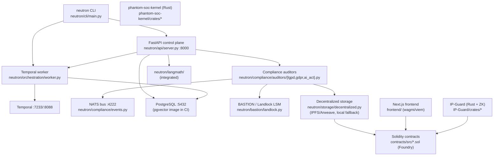

# SPEC.md — Forensic Audit of the "Neotron" Repository

> **Method**: Evidence-only reverse-engineering from code. Every claim is tagged
> `[VERIFIED]` (ran/read it), `[INFERRED]` (reasoned from code), or `[UNKNOWN]` (no evidence).
> Prose docs (README, ECOSYSTEM, etc.) are treated as **claims to verify**, not facts.
> **Date of audit**: 2026-06-23. **Repo root**: `/home/kernelcore/master/staging/neotron`.
> **Tooling caveat**: `tokei`/`cloc`, `pytest`, `forge`, `cargo` are **not installed** in the audit
> environment, so LOC is via `git ls-files | xargs wc -l`, test counts via `grep`, and any
> "passing / coverage / list" metric is recorded as **"not measured"** rather than estimated.

---

## 1. One-sentence definition

**Neotron (package `neutron-nexus`, branded "NEXUS") is a Python 3.13 AI-agent
*compliance-orchestration* platform — Temporal-driven workflows + a FastAPI control plane + a NATS
event bus — that adds kernel-level (Landlock LSM) file isolation, LGPD/GDPR/EU-AI-Act policy
auditors, and on-chain (Solidity/Foundry) audit & DeFi contracts, and is currently absorbing two
sibling subsystems: LangMath (LLM-bias research) and IP-Guard (on-chain license compliance).**
`[INFERRED]` — grounded in `pyproject.toml`, `neutron/api/server.py`, `neutron/compliance/`,
`neutron/bastion/landlock.py`, `contracts/src/`, `IP-Guard/`, and the `LangMath` gitlink.

---

## 2. Executive summary

- The real, runnable core is **Python under `neutron/`** (39,383 LOC across 143 files): a FastAPI
  server, a Temporal worker, compliance auditors, and a CLI. `[VERIFIED]`
- **Naming is inconsistent**: the directory is `neutron/`, the PyPI name is `neutron-nexus`, the
  README title is "NEXUS Platform", and the user calls the project "Neotron". All refer to the same
  thing. `[VERIFIED]`
- **Two `[project.scripts]` entry points are broken**: `neutron-gui` → `neutron.gui.app:main` and
  `neutron-dag` → `neutron.integration.dag_bridge:main` reference directories that **do not exist**.
  `[VERIFIED]`
- The headline security feature is **real Landlock LSM code** (`neutron/bastion/landlock.py`), but
  the README's marketing headline is "seccomp-BPF" — a mismatch between the claim and the
  implementation. `[VERIFIED]`
- **Decentralized audit (IPFS/Arweave) is real code but unwired by default**: the clients
  (`ipfshttpclient`, `ar`) are **not declared in any manifest**, so the import guards evaluate false
  and the code silently falls back to local file storage. `[VERIFIED]`
- README badges claim **"350+ Tests Passing"** and **"90%+ Coverage"**; the repo actually contains
  **573 `def test_` functions**, but passing-status and coverage are **not measurable here** (pytest
  absent; `htmlcov/` is a stale artifact). `[VERIFIED count / UNVERIFIED claims]`
- **LangMath** (top-level `LangMath/`) is an **embedded git repo / gitlink** whose source is *not
  tracked* by this repo; the *integrated* copy lives at `neutron/langmath/` (3,606 LOC). **IP-Guard**
  and **phantom-soc-kernel** are tracked Rust workspaces. **NEUROSEC** appears in **zero** code files
  (docs/marketing only). `[VERIFIED]`
- Solidity (`contracts/`, 6,006 LOC, 6 test files) and Rust (IP-Guard + phantom-soc, 6,215 LOC) are
  substantial but were **not compiled/tested** here (`forge`/`cargo` unavailable). `[VERIFIED size /
  UNKNOWN build status]`

---

## 3. Architecture

### Prose

The control plane is a **FastAPI** app (`neutron/api/server.py`) exposing task, agent, swarm, and
compliance endpoints, plus mounted routers for auth, audit, consent, policy, and oracle. Long-running
work is delegated to **Temporal** (worker at `neutron/orchestration/worker.py`, default address
`localhost:7233`). Components emit structured events over **NATS** (`nats://localhost:4222`,
`neutron/compliance/events.py`, `watchdog_agent.py`). Persistent state targets **PostgreSQL** (
`localhost:5432`; CI uses the `pgvector/pgvector:pg15` image, implying vector storage intent). The
**compliance** layer (`neutron/compliance/`) runs LGPD/GDPR/EU-AI-Act auditors and a "bastion" /
"sentinel" enforcement path; kernel-level file isolation is implemented via **Landlock LSM**
(`neutron/bastion/landlock.py`, `namespaces.py`). An on-chain layer (`contracts/`, Foundry) provides
audit-logging and DeFi contracts; a separate **IP-Guard** Rust+ZK subsystem verifies Nix-package
license compliance against an on-chain registry. A **Next.js** frontend (`frontend/`, wagmi/viem)
exists for the web3 surface.

### Mermaid (real components only)



`[VERIFIED]` for every node (each maps to a cited file); edges between API/worker/Temporal/NATS/PG are
`[INFERRED]` from import/config references, not a runtime trace.

---

## 4. Component / module inventory

| Path | Responsibility | Language | Status | Evidence |
|------|----------------|----------|--------|----------|
| `neutron/api/` | FastAPI server + routers (tasks, agents, swarm, auth, audit, consent, policy, oracle, compliance) | Python (4,148 LOC) | Implemented & wired | `server.py:242 app = FastAPI`; route grep §App |
| `neutron/compliance/` | LGPD/GDPR/AI-Act auditors, bastion/sentinel, NATS events, temporal_guard, watchdog | Python (4,626 LOC) | Implemented | `auditors/{lgpd,gdpr,ai_act,lgpd_kernel}.py`, `events.py`, `sentinel.py` |
| `neutron/langmath/` | Integrated LangMath: linguistic algebra, RAG, forensic DAG, attack/nuance detectors | Python (3,606 LOC, 14 files) | Implemented | `git ls-files 'neutron/langmath/*.py'` |
| `neutron/cli/` | `neutron` Click CLI (start/stop, links to Temporal/MLflow/Ray UIs) | Python (1,881 LOC) | Implemented | `pyproject` script `neutron=neutron.cli.main:main` |
| `neutron/events/` | Event bus / structured event model | Python (1,435 LOC) | Implemented | dir LOC |
| `neutron/bastion/` | Kernel file isolation: Landlock LSM via ctypes, per-workflow namespaces | Python (1,404 LOC) | Implemented (Landlock real) | `bastion/landlock.py` (syscalls 444/445/446) |
| `neutron/orchestration/` | Temporal worker | Python (982 LOC) | Implemented | `worker.py:106 async def main` |
| `neutron/agents/` | Agent definitions + LLM HTTP client to ml-offload-api | Python (966 LOC) | Implemented | `agents/_llm_http_client.py` |
| `neutron/siem/` | SIEM/CEF log formatters | Python (784 LOC) | Implemented | `siem/formatters.py` |
| `neutron/security/` | Git secret scanner etc. | Python (662 LOC) | Implemented | `security/git_scanner.py` |
| `neutron/reasoning/` | Oracle / ensemble reasoning | Python (512 LOC) | Implemented | `tests/reasoning/test_oracle.py` |
| `neutron/memory/` | Episodic memory (Postgres) | Python (463 LOC) | Implemented | `memory/episodic.py` (pg conn string) |
| `neutron/storage/` | Decentralized storage (IPFS/Arweave) + local fallback | Python (445 LOC) | Real code, **deps undeclared** → falls back to local | `storage/decentralized.py:22-34` |
| `neutron/spectre/` | "SPECTRE" subsystem | Python (448 LOC) | Implemented (scope unconfirmed) | 8 files reference SPECTRE |
| `neutron/license/`, `defi/`, `ml-lab/` | License mgmt, DeFi monitor, Cerebro optimizer | Python | Implemented | dir LOC; `defi/monitor.py` |
| `neutron/gui/`, `neutron/integration/` | Referenced by entry-point scripts | — | **ABSENT** | `ls` → "No such file or directory" |
| `contracts/src/` | Solidity: AuditLogger, ComplianceGuardrail, EmergencyStop, LendingProtocol, LGPDConsent, PriceOracle + dao/ + supplychain/ | Solidity (6,006 LOC) | Present; **not built here** | `ls contracts/src`; 6 `*.t.sol` |
| `IP-Guard/` | Rust workspace: ip-guard-cli/core/zk-commons + circom + ZK Solidity | Rust + Circom + Solidity | Present; **not built here** | `IP-Guard/crates/`; `cli/src/main.rs:1` |
| `phantom-soc-kernel/` | Rust workspace, 8 crates (cli/core/governance/mcp/memory/quality/security/soc) | Rust | Present; **not built here** | `ls phantom-soc-kernel/crates` |
| `LangMath/` (top-level) | Standalone LangMath research repo | — | **Gitlink (embedded repo), source not tracked here** | `git ls-files 'LangMath/*'` → empty |
| `frontend/` | Next.js 15 / React 19 / wagmi / viem web app | TypeScript/TSX (3,226 LOC) | Present; build status not measured | `frontend/package.json` |

---

## 5. Stack & dependencies

| Layer | Technology | Evidence |
|-------|-----------|----------|
| Language (primary) | Python ≥ 3.13 | `pyproject.toml` `requires-python = ">=3.13"` |
| Workflow engine | Temporal (`temporalio>=1.6.0`) | `pyproject.toml`; `worker.py` |
| API | FastAPI ≥0.110, Uvicorn, Pydantic v2 | `pyproject.toml`; `api/server.py:242` |
| Datastore | PostgreSQL (`psycopg2-binary`, SQLAlchemy 2); pgvector image in CI | `pyproject.toml`; CI `pgvector/pgvector:pg15` |
| Event bus | NATS (`nats-py>=0.8.0`) | `pyproject.toml`; `compliance/events.py:34` |
| CLI | Click ≥8.1 | `pyproject.toml`; `cli/main.py` |
| Build | Hatchling (`[build-system]`), also a `[tool.poetry]` block + `poetry.lock` + `uv.lock` | `pyproject.toml` |
| Smart contracts | Foundry (`foundry.toml`), OpenZeppelin + forge-std submodules | `.gitmodules`; `contracts/foundry.toml` |
| Rust subsystems | Cargo workspaces (IP-Guard, phantom-soc-kernel) | `Cargo.toml` files |
| Frontend | Next.js 15, React 19, wagmi 2, viem 2, Tailwind | `frontend/package.json` |
| Infra | Nix flakes (`flake.nix`), Docker Compose (postgres, temporal) | `flake.nix`; `docker-compose.yml` |
| CI | GitHub Actions: ruff/black/mypy + pytest (pg service) + Foundry | `.github/workflows/ci.yml` |
| **Undeclared at runtime** | `ipfshttpclient`, `ar` (Arweave), web3 — used in code, absent from manifests | `grep ... pyproject.toml requirements.txt` → empty |

---

## 6. Interfaces & entry points

**Console scripts** (`pyproject.toml [project.scripts]`):
- `neutron` → `neutron.cli.main:main` — **EXISTS** `[VERIFIED]`
- `neutron-worker` → `neutron.orchestration.worker:main` — **EXISTS** (`worker.py:106 async def main`) `[VERIFIED]`
- `neutron-gui` → `neutron.gui.app:main` — **BROKEN** (`neutron/gui` absent) `[VERIFIED]`
- `neutron-dag` → `neutron.integration.dag_bridge:main` — **BROKEN** (`neutron/integration` absent) `[VERIFIED]`

**HTTP API** (`neutron/api/server.py`, FastAPI): `GET /health`, `POST /api/v1/tasks`,
`GET /api/v1/tasks/{id}`, `GET /api/v1/agents`, `POST /api/v1/agents/execute`,
`POST /api/v1/swarm/execute`, `GET /api/v1/compliance/status`, `GET /v1/metrics`, `POST /v1/test/cortex`.
Mounted routers add `/login`,`/refresh`,`/apikeys` (auth), `/logs`,`/stats`,`/ipfs/{hash}` (audit),
`/tokens`,`/verify` (consent), policy CRUD, `/explain` (oracle), `/validate` (compliance). `[VERIFIED]`

**Ports referenced in code**: API 8000, Temporal 7233 / UI 8088, MLflow 5000, Ray 8265, Postgres 5432,
NATS 4222, IPFS 5001, eth RPC 8545, llama_cpp / ml-offload 8081. `[VERIFIED]`

**Rust CLI**: `ip-guard verify|extract|status|info` (`IP-Guard/crates/ip-guard-cli/src/main.rs`). `[VERIFIED]`

---

## 7. Metrics

| Metric | Value | Command used | Date |
|--------|-------|--------------|------|
| Total commits | 96 | `git log --oneline | wc -l` | 2026-06-23 |
| First / latest commit | `f1c1808` 2026-01-10 / `0d08d87` 2026-04-29 | `git log --reverse`, `git log -1` | 2026-06-23 |
| Authors | 1 (`marcosfpina`, two emails: voidnx.com / voidnxlabs.com) | `git shortlog -sne` | 2026-06-23 |
| Tracked files | 503 | `git ls-files | wc -l` | 2026-06-23 |
| Python LOC | 39,383 (143 files) | `git ls-files '*.py' | xargs wc -l` | 2026-06-23 |
| Rust LOC | 6,215 (45 files) | `git ls-files '*.rs' | xargs wc -l` | 2026-06-23 |
| Solidity LOC | 6,006 (24 files) | `git ls-files '*.sol' | xargs wc -l` | 2026-06-23 |
| TSX LOC | 3,226 (35 files) | `git ls-files '*.tsx' | xargs wc -l` | 2026-06-23 |
| Nix LOC | 1,231 (11 files) | `git ls-files '*.nix' | xargs wc -l` | 2026-06-23 |
| Python test functions | 573 | `git ls-files 'tests/**/*.py' | xargs grep -hE '^\s*(async )?def test_' | wc -l` | 2026-06-23 |
| Solidity test files | 6 | `git ls-files 'contracts/test/*.t.sol'` | 2026-06-23 |
| Tests passing | **not measured** (pytest/forge unavailable) | — | 2026-06-23 |
| Coverage | **not measured** (no run; `htmlcov/` is stale) | — | 2026-06-23 |
| Python runtime deps | ~14 declared | `pyproject.toml [project].dependencies` | 2026-06-23 |

> README badges assert "350+ Tests Passing" and "90%+ Coverage" and "Production Ready"; none of these
> are verifiable in this environment and the actual test-function count (573) does not match the badge.

---

## 8. Use cases (each cited to code/test/demo that demonstrates it)

1. **Compliance validation of an AI action (LGPD/GDPR/EU-AI-Act)** — `neutron/compliance/auditors/`,
   exercised by `tests/compliance/` (155 test functions) and `demos/eu_ai_act_demo.py`. `[VERIFIED]`
2. **Kernel-level file isolation per workflow** — `neutron/bastion/landlock.py`,
   `neutron/bastion/namespaces.py`; tested in `tests/compliance/test_bastion.py`. `[VERIFIED]`
3. **Agent task / swarm execution via API** — `POST /api/v1/agents/execute`,
   `POST /api/v1/swarm/execute` in `neutron/api/server.py`; `scripts/demo_swarm.py`. `[VERIFIED]`
4. **4-layer defense-in-depth audit trail (Python→kernel→contract→IPFS)** —
   `demos/test_4layer_flow.py`, `tests/integration/test_4layer_integration.py` (asserts `ipfs_cid`
   *or* `"simulated"`). `[VERIFIED — fallback path proven]`
5. **On-chain audit logging & DeFi compliance** — `contracts/src/AuditLogger.sol`,
   `LendingProtocol.sol`, `LGPDConsent.sol`; tests `contracts/test/*.t.sol`,
   `tests/integration/test_dao_e2e.py`. `[VERIFIED present, build not run]`
6. **Consent token lifecycle** — `neutron/api/consent_endpoints.py` + `tests/api/test_consent.py`. `[VERIFIED]`
7. **Nix package license compliance verification on-chain** — `IP-Guard/crates/ip-guard-cli/src/main.rs`
   (`ip-guard verify <flake.nix>`). `[VERIFIED present]`
8. **LLM-bias / adversarial linguistic analysis** — `neutron/langmath/subtle_attacks.py`,
   `nuance_detector.py`, `linguistic_algebra.py`. `[VERIFIED present]`

---

## 9. Security / compliance enforcement reality check

| Claimed capability | Reality | Evidence |
|--------------------|---------|----------|
| "Kernel-level enforcement via **seccomp-BPF**" (README headline) | The implemented kernel mechanism is **Landlock LSM** (inode-level file control), not seccomp. The module docstring even contrasts itself against seccomp. So the capability is real but **mis-described**. | `neutron/bastion/landlock.py:1-30` |
| Per-workflow isolation | Real Landlock ruleset per workflow. | `neutron/bastion/namespaces.py` |
| Immutable audit on **IPFS/Arweave** | Real client code exists, but `ipfshttpclient` and `ar` are **not in any manifest**, so `IPFS_AVAILABLE/ARWEAVE_AVAILABLE` are False on a default install and storage **falls back to local files**. Effectively a stub unless deps + daemons are added out-of-band. | `neutron/storage/decentralized.py:22-34,119-165`; manifest grep empty |
| Smart-contract compliance guardrails | Contracts exist (`ComplianceGuardrail.sol`, `EmergencyStop.sol`, `AuditLogger.sol`) with Foundry tests, but **not compiled/tested in this audit** (`forge` absent). | `contracts/src/`, `contracts/test/` |
| ZK license proofs | Circom circuits + ZKVerifier present in IP-Guard; trusted-setup script present. Build/proving **not run**. | `IP-Guard/circuits/`, `contracts/ZKVerifier.sol` |
| seccomp / AppArmor / nsjail / bubblewrap | **No seccomp/AppArmor/nsjail/firejail/bubblewrap usage found** in code (grep returned none for those). Only Landlock. | `grep -rniE 'nsjail|firejail|bubblewrap|bwrap'` → empty |

---

## 10. Naming & pivot map

| Name | Status in code | Real artifact |
|------|----------------|---------------|
| **NEUTRON / neutron** | 62 code files | The main Python package `neutron/` |
| **NEXUS** | 14 code files | Brand name (README title, `pyproject` name `neutron-nexus`); `neutron/compliance/nexus_flow.py` |
| **SENTINEL** | 24 code files | User-space policy layer; `neutron/compliance/sentinel.py` |
| **BASTION / BASTION-SC** | 20 code files | Kernel enforcement (`neutron/bastion/`); "BASTION-SC" = smart-contract side (`contracts/`) |
| **SPECTRE** | 8 code files | `neutron/spectre/` subsystem |
| **phantom (phantom-soc-kernel)** | 11 code files | Rust SOC workspace `phantom-soc-kernel/` |
| **NEUROSEC** | **0 code files** | **Docs/marketing only — no implementation** |
| **NEOTRON** | (user's name for the repo) | Same as `neutron/` package; not a distinct artifact |

**LangMath** `[VERIFIED]`: EXISTS in two forms —
  (a) top-level `LangMath/` is an **embedded git repo / gitlink** (`git ls-files 'LangMath/*'` → empty;
      shows as `Am LangMath`; **not** listed in `.gitmodules`) → its source is **not tracked** by this
      repo; (b) an **integrated copy** at `neutron/langmath/` (14 files, 3,606 LOC) that *is* tracked
      and imported. The standalone `LangMath/pyproject.toml` describes "langmath" 0.1.0 =
      "heuristics applied to advanced epistemology and linear algebra … behaviors and biases in
      language models."

**IP-Guard** `[VERIFIED]`: EXISTS, tracked directly (not a submodule). Rust workspace
  `IP-Guard/crates/{ip-guard-cli,ip-guard-core,zk-commons}` + circom circuits +
  `contracts/{IPGuard,Verifier,ZKVerifier}.sol`. Purpose (from CLI header): verify Nix-package SPDX
  license compliance against an on-chain `LicenseRegistry` (Ethereum/Polygon NFTs).

**Real git submodules** (`.gitmodules`): `lib/forge-std`, `contracts/lib/forge-std`,
`contracts/lib/openzeppelin-contracts` — all Foundry tooling, **not** product code.

**Single honest definition**: see §1.

---

## 11. Gaps, risks & contradictions (doc claims vs. code reality)

1. **Broken entry points**: `neutron-gui` and `neutron-dag` target non-existent modules
   (`neutron/gui`, `neutron/integration`). Installing the package and running them would fail. `[VERIFIED]`
2. **README "seccomp-BPF" vs. Landlock**: the marketing headline names a mechanism that the code does
   not use; the actual (and arguably stronger for files) mechanism is Landlock. `[VERIFIED]`
3. **IPFS/Arweave advertised as live ("immutable, 200+ year permanence") but deps undeclared** → by
   default the system writes audit logs to local disk, not a decentralized store. `[VERIFIED]`
4. **Unverifiable quality badges**: "350+ Tests Passing", "90%+ Coverage", "Production Ready", "A+
   Quality" — none measurable here; test-function count (573) doesn't match the "350+" badge; `htmlcov/`
   is a stale coverage artifact committed to the repo. `[VERIFIED stale artifact / UNKNOWN truth]`
5. **Empty-looking test directories at the glob level**: `tests/{agents,api,defi,…}` contain test
   files, but the headline 155 functions are concentrated in `tests/compliance/`; coverage of other
   subsystems (api, defi, memory, reasoning) is comparatively thin. `[INFERRED]`
6. **Dual build systems**: both Hatchling (`[build-system]`) and Poetry (`[tool.poetry]` + `poetry.lock`)
   plus a `uv.lock` are present — ambiguous canonical build path. `[VERIFIED]`
7. **Untracked LangMath gitlink**: the top-level `LangMath/` directory is an embedded repo not recorded
   in `.gitmodules`, so a fresh clone will not populate it correctly. `[VERIFIED]`
8. **Rust/Solidity build & test status unknown**: substantial on-chain and Rust code (12k+ LOC) was not
   compiled or tested in this audit. `[UNKNOWN]`
9. **Committed artifacts / secrets-shaped files**: `htmlcov/`, `*.log`, `data/ssh_sessions.db`,
   `IP-Guard/secrets/secrets.yaml`, broadcast JSON under `contracts/broadcast/` are checked in — review
   for hygiene/leakage. `[VERIFIED present / sensitivity UNKNOWN]`

---

## 12. Open questions for the maintainer

1. Which is canonical — "Neotron", "Neutron", or "NEXUS"? Should the package be renamed for consistency?
2. Are `neutron-gui` / `neutron-dag` planned (and the modules just not committed) or should the broken
   scripts be removed?
3. Is the security headline supposed to be **seccomp** *and* **Landlock**, or should the docs be
   corrected to Landlock-only?
4. Should `ipfshttpclient`/`ar`/web3 be promoted to real (optional) dependencies, or is local-fallback
   the intended production behavior?
5. Should top-level `LangMath/` be a proper submodule (added to `.gitmodules`) or vendored into
   `neutron/langmath/` and the duplicate removed?
6. What are the real, measured test/coverage numbers (run `pytest --cov` / `forge test`)? Should the
   README badges be regenerated from CI instead of hardcoded?
7. Is `IP-Guard/secrets/secrets.yaml` (and the checked-in DBs/logs) intended to be in version control?
8. What is the intended scope of `neutron/spectre/` and the `phantom-soc-kernel` Rust workspace relative
   to the Python core — separate product or integrated subsystem?

---

## Evidence Appendix (exact commands & key outputs)

```
$ git rev-parse --show-toplevel
/home/kernelcore/master/staging/neotron

$ git log --oneline | wc -l            → 96
$ git log -1 --format='%h %ci'         → 0d08d87 2026-04-29 17:21:41 -0300
$ git log --reverse --format='%h %ci %s' | head -1
  f1c1808 2026-01-10 19:01:40 -0200 Migrate to Poetry for dependency management
$ git shortlog -sne                    → 87 marcosfpina <sec@voidnx.com>; 9 <sec@voidnxlabs.com>
$ tokei || cloc ...                    → NO tokei/cloc  (not installed)

# LOC (tracked) via: git ls-files '*.<ext>' | xargs wc -l | tail -1
py 39383 (143 files) · rs 6215 (45) · sol 6006 (24) · tsx 3226 (35) · nix 1231 (11) · ts 80

# neutron/ submodule LOC (git ls-files | xargs wc -l)
compliance 4626 · api 4148 · langmath 3606 · cli 1881 · events 1435 · bastion 1404 · orchestration 982 ...

$ ls neutron/gui neutron/integration   → both: "No such file or directory"

$ grep -nE 'app = FastAPI' neutron/api/server.py     → 242
# routes: /health, /api/v1/tasks, /api/v1/agents, /api/v1/swarm/execute, /api/v1/compliance/status, /v1/metrics ...

$ python -m pytest --collect-only      → "No module named pytest"
# test functions:
$ git ls-files 'tests/**/*.py' | xargs grep -hE '^\s*(async )?def test_' | wc -l   → 573
# tests/compliance alone: 155

$ which forge                          → "forge not found"
$ git ls-files 'contracts/test/*.t.sol'
  AuditLogger.t.sol EmergencyStop.t.sol IntelAgentDAO.t.sol LGPDConsent.t.sol LendingProtocol.t.sol PriceOracle.t.sol

# Security mechanisms
$ grep -rliE 'seccomp|landlock' --include='*.py'     → neutron/bastion/landlock.py, namespaces.py, ...
$ grep -rniE 'nsjail|firejail|bubblewrap|bwrap'      → (none)
neutron/bastion/landlock.py:1   "BASTION Landlock — Kernel-level file access control via Landlock LSM."
  syscalls: landlock_create_ruleset 444 / add_rule 445 / restrict_self 446

# IPFS reality
$ sed -n '22,27p' neutron/storage/decentralized.py
  try: import ipfshttpclient; IPFS_AVAILABLE = True
  except ImportError: IPFS_AVAILABLE = False
$ grep -rinE 'ipfshttpclient|arweave|web3' pyproject.toml requirements.txt   → (empty: undeclared)

# Naming map (file counts in neutron + phantom-soc-kernel)
NEUTRON 62 · SENTINEL 24 · BASTION 20 · NEXUS 14 · phantom 11 · SPECTRE 8 · NEUROSEC 0

# LangMath / IP-Guard
$ git ls-files 'LangMath/*'             → (empty: gitlink/embedded repo, not tracked)
$ cat .gitmodules                       → forge-std (x2), openzeppelin-contracts (no LangMath/IP-Guard)
$ ls IP-Guard/crates                    → ip-guard-cli  ip-guard-core  zk-commons
$ ls phantom-soc-kernel/crates          → cli core governance mcp memory quality security soc
$ git ls-files 'phantom-soc-kernel/*' | head   → tracked directly

# CI / infra
.github/workflows/ci.yml: lint(ruff/black/mypy continue-on-error) + test-python(pgvector/pgvector:pg15) + Foundry
docker-compose.yml services: postgres, temporal
frontend/package.json: next ^15.1.4, react ^19, viem ^2.21, wagmi ^2.14
```

*Audit complete. No source files were modified; only this `SPEC.md` was created.*
