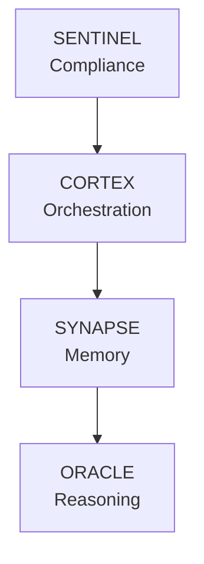

# NEXUS Documentation

## 📚 Core Documents

### Strategic Planning
- **[ROADMAP.md](../ROADMAP.md)** - 16-week implementation plan.
- **[NEXUS.md](../NEXUS.md)** - Vision and architecture.
- **[PROJECT_STATUS.md](../PROJECT_STATUS.md)** - Current status.
- **[CHANGELOG.md](../CHANGELOG.md)** - Version history.

### Developer Guides
- **[INSTALL.md](INSTALL.md)** - Setup with Nix & Just.
- **[API.md](API.md)** - Public API Reference.
- **[CI_CD_GUIDE.md](CI_CD_GUIDE.md)** - Testing & CI pipeline.
- **[SENTINEL_DESIGN.md](SENTINEL_DESIGN.md)** - Compliance architecture.
- **[SHOWCASE.md](SHOWCASE.md)** - Technical engineering tour.

### Quick Links by Role

#### For Developers
1.  Start with **[INSTALL.md](INSTALL.md)**.
2.  Read **[API.md](API.md)**.
3.  Check **[SENTINEL_DESIGN.md](SENTINEL_DESIGN.md)**.

#### For Product/Business
1.  Read **[ROADMAP.md](../ROADMAP.md)**.
2.  Review **[NEXUS.md](../NEXUS.md)**.

---

## Architecture Overview

---

## Contributing

Please read **[CONTRIBUTING.md](../CONTRIBUTING.md)** before submitting PRs.