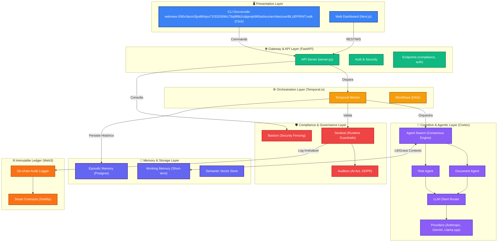

# 🏗️ Neutron Platform - Architecture Blueprint

Este documento apresenta a planta arquitetônica atual do projeto **Neutron**, detalhando a separação de responsabilidades (Separation of Concerns) e o fluxo de dados entre os módulos.

## 🗺️ Diagrama de Componentes (Mermaid)

---

## 🏢 Planta Baixa: Separação de Funções (Separation of Concerns)

A arquitetura do Neutron foi desenhada para ser altamente modular. Cada camada tem uma responsabilidade estrita.

### 1. Presentation Layer (`frontend/` & `neutron/cli/`)
- **Responsabilidade**: Interação com o usuário humano ou chamadas de CI/CD.
- **Regra**: Não contém lógica de negócios pesada, apenas renderização de estado e roteamento de comandos.

### 2. Gateway Layer (`neutron/api/`)
- **Responsabilidade**: Exposição de serviços via REST/WebSocket (FastAPI). Autenticação, limitação de taxa (rate limiting) e roteamento inicial.
- **Regra**: Todo request externo precisa passar por aqui e ser validado antes de acionar recursos caros (como LLMs ou Workflows).

### 3. Orchestration Layer (`neutron/orchestration/`)
- **Responsabilidade**: Gerenciar estados assíncronos, tentativas de falha (retries) e transações distribuídas utilizando o **Temporal.io**.
- **Regra**: O motor de orquestração não processa dados pesados, ele apenas *coordena* quem faz o quê e quando.

### 4. Cognitive Layer (`neutron/agents/` & `neutron/reasoning/`)
- **Responsabilidade**: O "Cérebro" do sistema. É onde o Cortex Swarm reside. Recebe tarefas isoladas, debate (Consensus Strategy) e devolve respostas.
- **Regra**: Agentes não salvam no banco diretamente e não chamam a API. Eles recebem `Task` e devolvem `AgentResponse`. O Roteador LLM abstrai qual modelo está sendo usado no momento.

### 5. Compliance Layer (`neutron/compliance/`)
- **Responsabilidade**: O sistema imunológico (Sentinel, Bastion). Garante que a plataforma siga as leis (LGPD, AI Act).
- **Regra**: Age como um middleware interceptador. Pode bloquear (Circuit Breaker) qualquer decisão de agente se ferir políticas.

### 6. Storage & Memory (`neutron/memory/` & `neutron/storage/`)
- **Responsabilidade**: Persistência de dados (PostgreSQL, Vector DBs, MLflow).
- **Regra**: Abstração total. As outras camadas apenas usam `memory.store()` sem saber se está salvando em Postgres, Redis ou arquivo local.

### 7. Blockchain / Web3 (`contracts/`)
- **Responsabilidade**: Registro inalterável de auditoria e lógica descentralizada de finanças (se ativado).
- **Regra**: Trata apenas informações vitais (hashes de auditoria, eventos de bloqueio), pois o armazenamento on-chain é caro.

---

## 🚀 Como evoluir a partir deste Blueprint?

Para desenvolver novos recursos, seguimos este fluxo mental usando o mapa:

1. **Nova Regra de Negócio (ex: Nova Lei de IA)?** -> Mexemos em `neutron/compliance/auditors/`.
2. **Novo Tipo de Inteligência?** -> Criamos um novo agente em `neutron/agents/specialized/`.
3. **Novo LLM?** -> Adicionamos apenas ao `neutron/agents/providers/`.
4. **Fluxo Longo e Frágil?** -> Criamos um Workflow no `neutron/orchestration/`.
5. **Nova Tela?** -> Mexemos em `frontend/` e expomos o endpoint em `neutron/api/`.

Essa estrutura isola o código. Você pode trocar o banco de dados sem que os Agentes saibam, e pode trocar de Anthropic para Llama.cpp local sem que o Frontend perceba.
