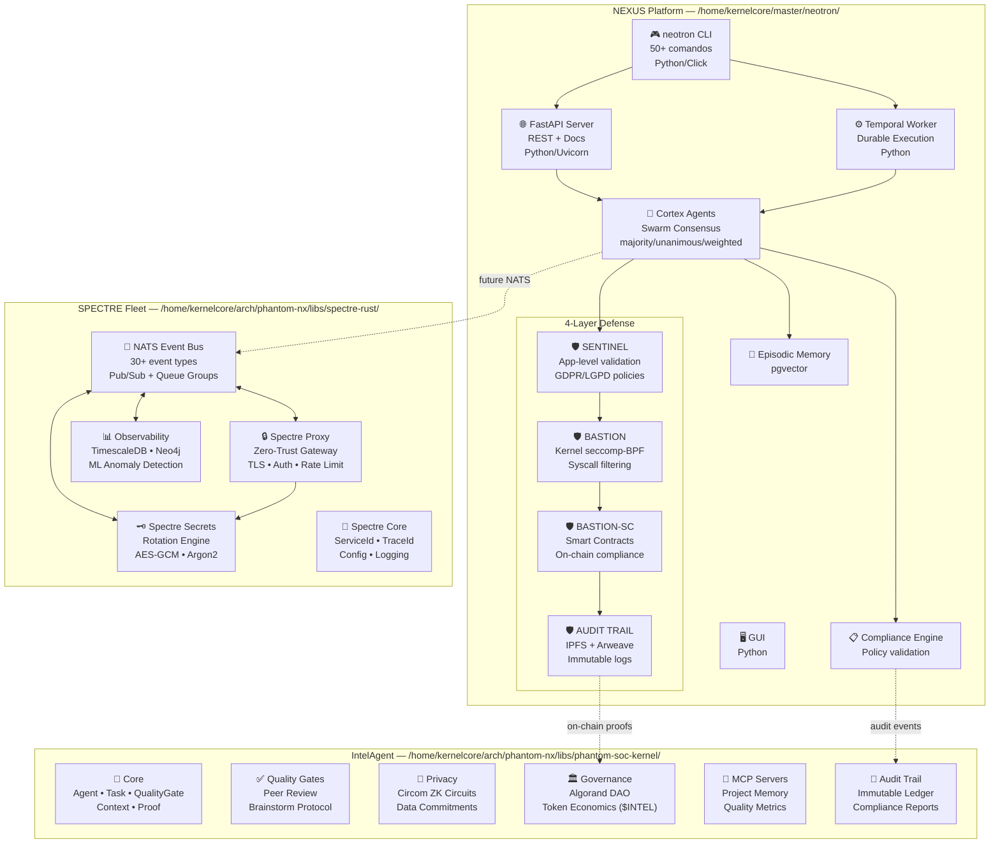
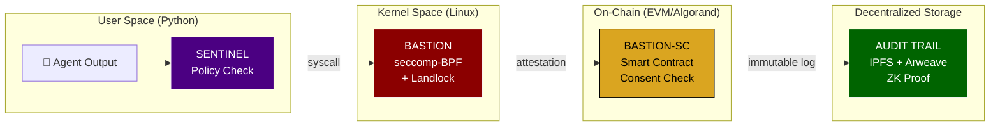
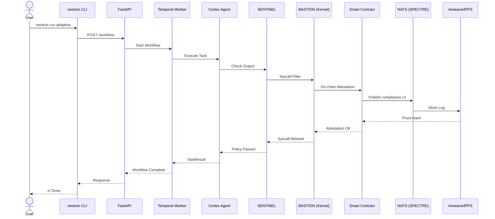
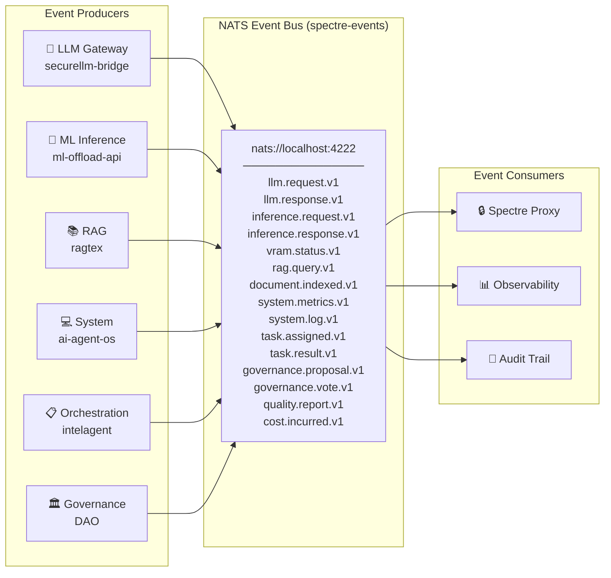
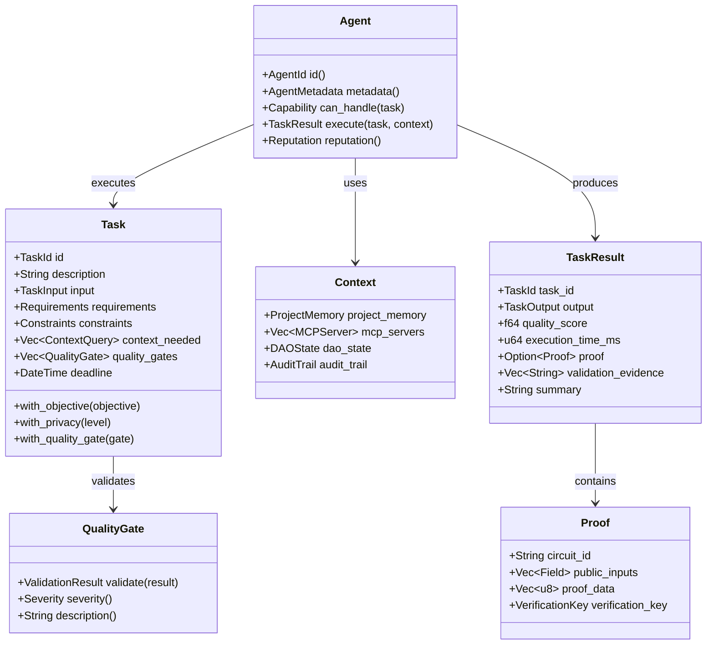
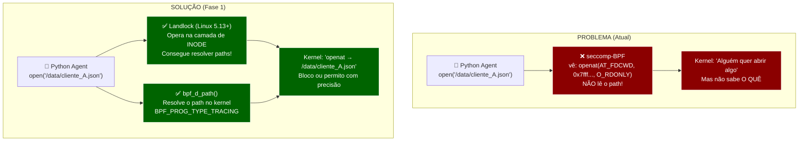
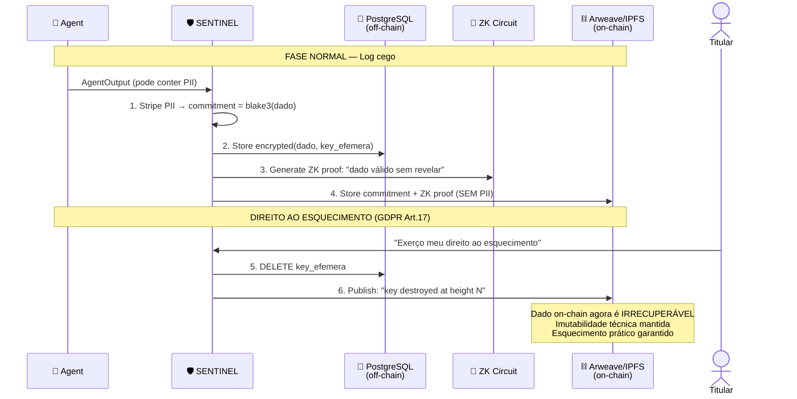
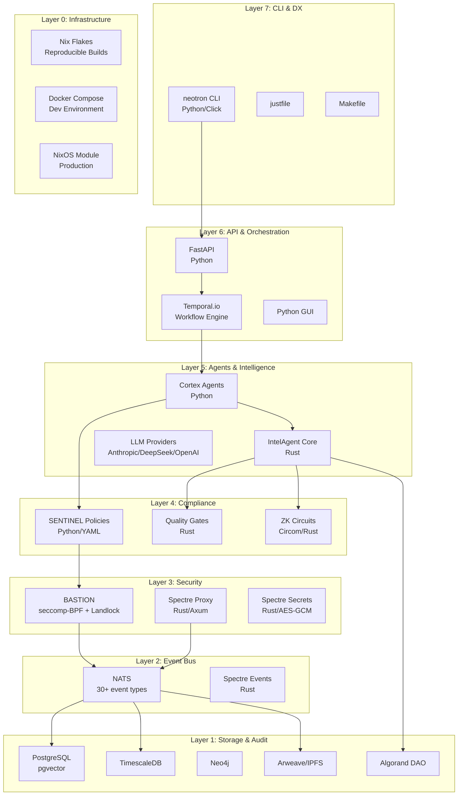
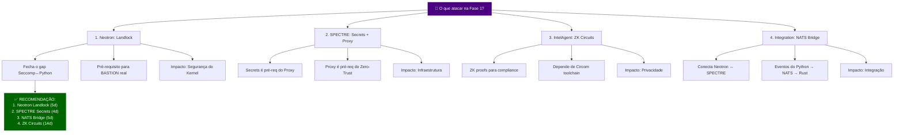

# NEXUS / Neotron — Diagramas da Arquitetura

**Status:** Living document  
**Última atualização:** 2026-04-08  
**Propósito:** Visualizar o ecossistema completo (Neotron + IntelAgent + SPECTRE)

---

## 1. Visão Macro: O Ecossistema Completo



---

## 2. As 4 Camadas de Defense-in-Depth



---

## 3. Fluxo de Dados: Requisição → Resposta



---

## 4. SPECTRE Event Bus: Todos os Event Types



---

## 5. IntelAgent Core: Abstrações e Relações



---

## 6. Roadmap Cross-Codebase: Fases e Dependências

```mermaid
gantt
    title NEXUS Ecosystem Roadmap
    dateFormat YYYY-MM-DD
    axisFormat %b %d

    section Neotron (Python)
    Fase 0: CLI Unificada               :done, n0, 2026-04-01, 3d
    Fase 1a: Landlock + bpf_d_path      :n1a, 2026-04-08, 5d
    Fase 1b: Esquecimento Criptográfico  :n1b, after n1a, 5d
    Fase 1c: Namespace Isolation         :n1c, after n1b, 3d
    Fase 2: Alinhamento Narrativa        :n2, after n1c, 3d
    Fase 3: Testes de Regressão          :n3, after n2, 4d

    section SPECTRE (Rust)
    Fase 0: Core + Events (30 tipos)    :done, s0, 2026-01-01, 14d
    Fase 1a: spectre-secrets            :s1a, 2026-04-08, 4d
    Fase 1b: spectre-proxy              :s1b, after s1a, 6d
    Fase 2: spectre-observability       :s2, after s1b, 10d

    section IntelAgent (Rust)
    Fase 0: Core Abstractions           :done, i0, 2025-12-15, 14d
    Fase 1: ZK Circuits (Circom)        :i1, 2026-04-15, 14d
    Fase 2: DAO Smart Contracts         :i2, after i1, 10d
    Fase 3: MCP Servers                 :i3, after i2, 7d

    section Integration
    Neotron ↔ SPECTRE (NATS bridge)     :int1, after n1a, 5d
    Neotron ↔ IntelAgent (ZK proofs)    :int2, after i1, 5d
    E2E Tests                            :int3, after int1, 3d
```

---

## 7. Detalhe: O Paradoxo Seccomp → Correção com Landlock



---

## 8. Detalhe: O Paradoxo Esquecimento → Correção com Chave Efêmera



---

## 9. Stack Tecnológica por Camada



---

## 10. Mapa de Decisão: O Que Fazer Primeiro



---

## Notas

- **Mermaid.js**: Esses diagramas são renderizados nativamente no GitHub, GitLab, e qualquer Markdown viewer compatível com Mermaid.
- **Atualização**: Este documento deve ser atualizado sempre que uma fase for concluída ou um diagrama ficar desatualizado.
- **ADR**: Decisões arquiteturais derivadas destes diagramas devem ser registradas como ADRs no diretório `docs/architecture/`.
