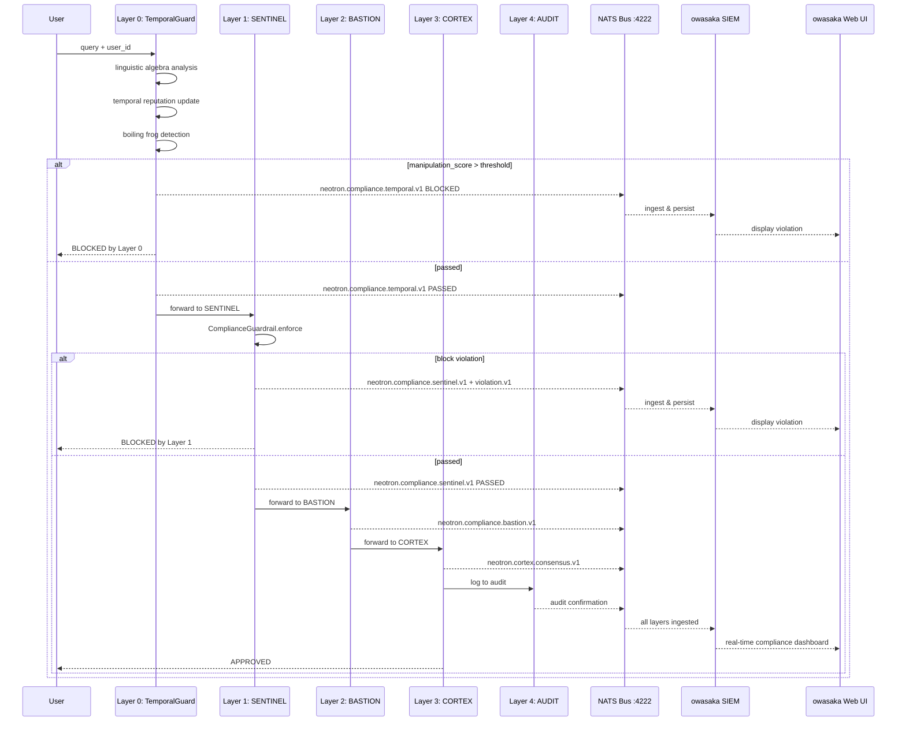

# LangMath + OWASAKA SIEM Integration Plan

## Overview

Three-project integration:
1. **LangMath** → **neotron**: Add temporal reputation + linguistic algebra as a "Layer 0" compliance pre-guard
2. **neotron** → **owasaka SIEM**: Ingest neotron compliance logs via NATS for SIEM correlation & visualization
3. **Remediation**: Fix leaked API keys found during discovery

---

## 1. Current Architecture

### neotron 4-Layer Compliance Pipeline

```
User Query
    ↓
┌──────────────────────────────────────┐
│ Layer 1: SENTINEL (Application)      │  ← GDPR/LGPD/SOC2 guardrails
│  - ComplianceGuardrail.enforce()     │     logs to AuditLogger → NATS
└──────────────┬───────────────────────┘
               ↓
┌──────────────────────────────────────┐
│ Layer 2: BASTION (Kernel)            │  ← seccomp-BPF enforcement
│  - KernelPolicy.enforce()            │
└──────────────┬───────────────────────┘
               ↓
┌──────────────────────────────────────┐
│ Layer 3: CORTEX (Swarm Consensus)    │  ← Multi-agent LLM decision
│  - AgentSwarm with weighted voting   │
└──────────────┬───────────────────────┘
               ↓
┌──────────────────────────────────────┐
│ Layer 4: AUDIT (Immutable)           │  ← IPFS/Arweave/Blockchain
│  - DecentralizedStorage              │
└──────────────┬───────────────────────┘
               ↓
        Execute Query
```

### Existing NATS Subjects (neotron → owasaka)

| Subject | Source | Emitted By |
|---------|--------|-----------|
| `neotron.compliance.sentinel.v1` | `audit_logger.py` | `AuditLogger.log()` → `publish_sync()` |
| `neotron.compliance.bastion.v1` | `events.py` doc | Defined but not yet published |
| `neotron.cortex.consensus.v1` | `events.py` doc | Defined but not yet published |
| `neotron.compliance.violation.v1` | `events.py` doc | Defined but not yet published |

### owasaka NATS Publishing (owasaka → others)

| Subject | Content | Emitted By |
|---------|---------|-----------|
| `network.dns.query.v1` | DNS query events | `Pipeline.PushNetworkEvent()` |
| `network.service.detected.v1` | Port scan / proxy events | `Pipeline.PushNetworkEvent()` |
| `network.dns.threat.v1` | Threat alerts | `Pipeline.PushNetworkEvent()` |
| `network.asset.discovered.v1` | Asset discovery | `Pipeline.PushNetworkEvent()` |
| `network.topology.updated.v1` | Topology updates | `Pipeline.PushAsset()` |

> **Key finding**: owasaka currently only *publishes* to NATS. It does not *subscribe* to any NATS subjects. We need to add a neotron compliance subscriber.

---

## 2. Target Architecture (After Integration)

```
User Query
    ↓
┌──────────────────────────────────────────────────────┐
│ Layer 0: TEMPORAL (NEW — LangMath)                   │
│  - TemporalReputation: decay-based reputation track  │
│  - CriticalDiscourseAnalyzer: linguistic algebra     │
│  - Boiling frog attack detection (gradual escalation)│
│  - Dynamic threshold adjustment per agent            │
│  - Forensics DAG for incident analysis               │
└─────────────────────┬────────────────────────────────┘
                      ↓
┌──────────────────────────────────────────────────────┐
│ Layer 1: SENTINEL (Application)                      │
│  - Existing ComplianceGuardrail.enforce()             │
│  - Now enriched with temporal context                │
└─────────────────────┬────────────────────────────────┘
                      ↓
┌──────────────────────────────────────────────────────┐
│ Layer 2: BASTION (Kernel)                            │
│  - Unchanged seccomp-BPF enforcement                 │
└─────────────────────┬────────────────────────────────┘
                      ↓
┌──────────────────────────────────────────────────────┐
│ Layer 3: CORTEX (Swarm Consensus)                    │
│  - Unchanged multi-agent LLM decision                │
└─────────────────────┬────────────────────────────────┘
                      ↓
┌──────────────────────────────────────────────────────┐
│ Layer 4: AUDIT (Immutable)                           │
│  - Unchanged IPFS/Arweave logging                    │
└─────────────────────┬────────────────────────────────┘
                      ↓
               Execute Query
                      │
                      ▼  (all events flow via NATS)
              ┌─────────────────┐
              │  NATS Broker    │
              │  localhost:4222 │
              └──────┬──────────┘
                     │ subscribe neotron.compliance.*
                     ▼
              ┌──────────────────────────────────────────┐
              │  owasaka SIEM (Neotron Compliance Ingest) │
              │                                           │
              │  1. Receive neotron compliance events     │
              │  2. Persist to BoltDB                     │
              │  3. Broadcast to WebSocket UI             │
              │  4. Sign with Ed25519 (ADR-0062)          │
              │  5. Feed to correlation engine            │
              │  6. ML anomaly detection                  │
              │  7. Transparency log (ADR-0063)           │
              └──────────────────────────────────────────┘
```

---

## 3. Implementation Steps

### Step A: Remediate Leaked API Keys (CRITICAL PRIORITY)

**File**: [`~/arch/LangMath/python/nuance_detector.py`](../../../arch/LangMath/python/nuance_detector.py)

Lines 155-157 contain hardcoded API keys (values redacted; rotate all three):
- `ANTHROPIC_API_KEY`: `sk-ant-api03-***REDACTED***`
- `openai_api_key`: `sk-proj-***REDACTED***`
- `deepseek_api_key`: `sk-***REDACTED***`

**Action**: Replace with environment variable lookups or remove. Use `os.getenv("ANTHROPIC_API_KEY")` pattern.

---

### Step B: LangMath as neotron Dependency

**File**: [`pyproject.toml`](./pyproject.toml)

Add LangMath as a local path dependency:

```toml
dependencies = [
    # ... existing deps ...
    "langmath @ file:///home/kernelcore/arch/LangMath",
]
```

Or for editable dev workflow, add to project scripts / justfile:
```bash
pip install -e /home/kernelcore/arch/LangMath
```

---

### Step C: Create neotron Temporal Guard Module

**New file**: [`neutron/compliance/temporal_guard.py`](./neutron/compliance/temporal_guard.py)

This is the core integration module. Pattern follows the existing blueprint at [`LangMath/python/neutron_integration.py`](../../../arch/LangMath/python/neutron_integration.py) but adapted as a proper neotron compliance layer.

```python
"""
Temporal Guard — Layer 0 compliance pre-guard using LangMath.

Integrates TemporalReputation + CriticalDiscourseAnalyzer as a
pre-layer before SENTINEL to detect boiling-frog attacks.
"""
from langmath.temporal_reputation import TemporalReputation  # after package install
from langmath.linguistic_algebra import CriticalDiscourseAnalyzer
from dataclasses import dataclass


@dataclass
class TemporalVerdict:
    passed: bool
    reputation: float
    risk_score: float
    threshold: float
    escalation_detected: bool
    manipulation_score: float
    reason: str


class TemporalGuard:
    """Layer 0: Temporal + Linguistic analysis for neotron compliance."""

    def __init__(self):
        self.temporal_rep = TemporalReputation(
            decay_rate=0.001,
            learning_rate=0.15,
            history_window=100,
        )
        self.math_analyzer = CriticalDiscourseAnalyzer()

    def validate(self, agent_id: str, content: str) -> TemporalVerdict:
        # 1. Linguistic analysis → manipulation score
        math_result = self.math_analyzer.analyze(content)
        manipulation_score = math_result['manipulation_score']

        # 2. Update temporal reputation
        R, event = self.temporal_rep.update_reputation(
            agent_id=agent_id,
            query=content,
            risk_score=manipulation_score,
            was_blocked=False,
        )

        # 3. Detect gradual escalation (boiling frog)
        escalation = self.temporal_rep.detect_gradual_escalation(agent_id, window=5)

        # 4. Get dynamic threshold
        threshold = self.temporal_rep.get_dynamic_threshold(agent_id)

        # 5. Decision
        passed = manipulation_score <= threshold
        reason = (
            f"Temporal: risk={manipulation_score:.3f} <= threshold={threshold:.3f}"
            if passed else
            f"Temporal BLOCKED: manipulation={manipulation_score:.3f} > threshold={threshold:.3f}"
        )

        return TemporalVerdict(
            passed=passed,
            reputation=R,
            risk_score=manipulation_score,
            threshold=threshold,
            escalation_detected=escalation.get('escalation_detected', False),
            manipulation_score=manipulation_score,
            reason=reason,
        )
```

---

### Step D: Wire Temporal Guard into NEXUS Compliance Flow

**File**: [`neutron/compliance/nexus_flow.py`](./neutron/compliance/nexus_flow.py)

Modify [`NEXUSComplianceFlow`](./neutron/compliance/nexus_flow.py:78) to insert Layer 0 before [`_layer1_sentinel()`](./neutron/compliance/nexus_flow.py:198).

**Changes**:
1. Add `enable_temporal: bool = True` to [`__init__()`](./neutron/compliance/nexus_flow.py:94)
2. Add lazy-load for TemporalGuard (similar to [`_get_sentinel()`](./neutron/compliance/nexus_flow.py:125))
3. Insert `_layer0_temporal()` call before `_layer1_sentinel()` in the validate flow
4. Publish temporal results to NATS subject `neotron.compliance.temporal.v1`
5. If temporal blocks, emit violation on `neotron.compliance.violation.v1`
6. Add temporal metadata to [`LayerResult`](./neutron/compliance/nexus_flow.py:50)

---

### Step E: Enable NATS in neotron Configuration

**File**: [`config/integrations.yaml`](./config/integrations.yaml)

```yaml
spectre:
  nats:
    enabled: true          # was: false
    url: "nats://localhost:4222"
```

This activates the NATS publishing in [`events.py`](./neutron/compliance/events.py) so compliance events flow to the NATS bus.

---

### Step F: Create owasaka Neotron Compliance Subscriber

**New file**: [`~/master/owasaka/internal/events/neotron.go`](../../../owasaka/internal/events/neotron.go)

```go
package events

// NeotronComplianceSubscriber listens on neotron.compliance.* subjects
// and pushes them into the owasaka SIEM pipeline.
type NeotronComplianceSubscriber struct {
    nc       *nats.Conn
    pipeline *Pipeline
    logger   *logging.Logger
}

func NewNeotronSubscriber(nc *nats.Conn, pipeline *Pipeline, logger *logging.Logger) (*NeotronComplianceSubscriber, error) {
    sub := &NeotronComplianceSubscriber{nc: nc, pipeline: pipeline, logger: logger}
    // Subscribe to all neotron compliance subjects
    _, err := nc.Subscribe("neotron.compliance.>", func(msg *nats.Msg) {
        sub.handleComplianceEvent(msg)
    })
    if err != nil {
        return nil, fmt.Errorf("subscribe neotron.compliance: %w", err)
    }
    return sub, nil
}

func (s *NeotronComplianceSubscriber) handleComplianceEvent(msg *nats.Msg) {
    // 1. Parse the neotron compliance event JSON
    // 2. Convert to owasaka NetworkEvent model
    // 3. Push through pipeline (persist, WebSocket, sign, correlate)
}
```

**Conversion mapping** — neotron compliance event → owasaka [`NetworkEvent`](../../../owasaka/internal/models/event.go):

| Neotron Field | Owasaka NetworkEvent Field |
|--------------|---------------------------|
| `audit_id` | `ID` (prefixed `neotron-`) |
| `guardrail_name` | `Metadata["guardrail_name"]` |
| `regulation` | `Metadata["regulation"]` |
| `severity` | `Type` (maps to `EventAlert` for blocks, `EventDNS` for passes) |
| `passed` | `Metadata["compliant"]` |
| `agent_output_hash` | `Metadata["output_hash"]` |
| `source` = "neotron" | `Source` |
| `timestamp` | `Timestamp` |

---

### Step G: Wire Neotron Subscriber in owasaka app.go

**File**: [`~/master/owasaka/internal/app/app.go`](../../../owasaka/internal/app/app.go)

In [`App.Run()`](../../../owasaka/internal/app/app.go:60), after the existing NATS publisher setup (line 88), add:

```go
// Subscribe to neotron compliance events
var neotronSub *events.NeotronComplianceSubscriber
if pub != nil && pub.IsConnected() {
    neotronSub, err = events.NewNeotronSubscriber(pub.nc, pipeline, a.logger)
    if err != nil {
        a.logger.Warnw("Failed to subscribe to neotron compliance events", "error", err)
    } else {
        a.logger.Infow("Subscribed to neotron compliance events")
    }
}
```

Also add a health probe for the neotron subscription:

```go
healthRegistry.Register(health.NewStaticProbe("neotron-compliance", false, func() health.Result {
    if neotronSub == nil {
        return health.Result{Status: health.StatusDisabled}
    }
    return health.Result{Status: health.StatusHealthy}
}))
```

---

### Step H: Add NATS dependency to owasaka if missing

**File**: [`~/master/owasaka/go.mod`](../../../owasaka/go.mod)

The `nats.go` dependency should already be present since `publisher.go` imports it. Verify:

```
github.com/nats-io/nats.go vX.Y.Z
```

---

## 4. Event Flow Diagram



---

## 5. New NATS Subject Schema

| Subject | Direction | Content | New? |
|---------|-----------|---------|------|
| `neotron.compliance.temporal.v1` | neotron → NATS | Layer 0 temporal guard verdicts | **NEW** |
| `neotron.compliance.sentinel.v1` | neotron → NATS | Layer 1 SENTINEL results | Existing |
| `neotron.compliance.bastion.v1` | neotron → NATS | Layer 2 BASTION enforcement | Existing |
| `neotron.cortex.consensus.v1` | neotron → NATS | Layer 3 swarm decisions | Existing |
| `neotron.compliance.violation.v1` | neotron → NATS | All blocking violations | Existing |

---

## 6. Files Modified / Created Summary

| Project | File | Action |
|---------|------|--------|
| LangMath | `python/nuance_detector.py` | **FIX**: Remove hardcoded API keys |
| neotron | `pyproject.toml` | **EDIT**: Add `langmath` path dependency |
| neotron | `neutron/compliance/temporal_guard.py` | **CREATE**: New TemporalGuard class (Layer 0) |
| neotron | `neutron/compliance/nexus_flow.py` | **EDIT**: Wire Layer 0 into compliance flow |
| neotron | `config/integrations.yaml` | **EDIT**: Enable NATS for spectre |
| owasaka | `internal/events/neotron.go` | **CREATE**: Neotron compliance subscriber |
| owasaka | `internal/app/app.go` | **EDIT**: Wire subscriber + health probe |

---

## 7. Testing Strategy

### neotron-side tests
- `tests/compliance/test_temporal_guard.py`: Unit tests for TemporalGuard
  - Verify manipulation scoring
  - Verify boiling frog detection
  - Verify dynamic threshold adaptation
- Integration test: Run `NEXUSComplianceFlow` with TemporalGuard enabled, verify 5-layer flow

### owasaka-side tests
- Unit test: Parse neotron compliance event JSON, verify conversion to `NetworkEvent`
- Integration test: Start NATS, publish mock neotron event, verify owasaka ingests it
- End-to-end: Full pipeline with real NATS broker

---

## 8. Security Considerations

1. **API Key Remediation**: The hardcoded keys in `nuance_detector.py` must be revoked and replaced with env vars BEFORE any code is committed
2. **NATS Authentication**: owasaka already supports NKey auth for NATS — ensure neotron also authenticates when connecting
3. **Event Signing**: owasaka signs events with Ed25519 (ADR-0062). Neotron compliance events should also be signed when entering the owasaka pipeline
4. **Transparency Log**: Critical violations should enter the Merkle transparency log (ADR-0063)

---

## 9. Execution Order

1. 🔴 **FIX LEAKED KEYS** in `nuance_detector.py` — immediate priority
2. Add LangMath as neotron dependency
3. Create `neutron/compliance/temporal_guard.py`
4. Modify `nexus_flow.py` to insert Layer 0
5. Enable NATS in `config/integrations.yaml`
6. Create `internal/events/neotron.go` in owasaka
7. Wire subscriber in owasaka `app.go`
8. Write tests
9. End-to-end validation

---

## 10. IMPLEMENTATION STATUS (Updated 2026-05-21)

### ✅ DONE — SIEM Export Pipeline

**Neotron side (Python):**
- `neutron/siem/__init__.py` — SIEM exporter facade
- `neutron/siem/formatters.py` — 4 formats: CEF (ArcSight/Splunk), LEEF (QRadar), JSON (Elastic/Owasaka), Syslog RFC 5424
- `neutron/siem/exporters.py` — 3 transports: File (agent pickup), Syslog UDP/TCP, NATS
- `neutron/cli/main.py` — `neotron siem` command group (status, export, tail, test)

**Owasaka side (Go):**
- `internal/models/event.go` — Added `EventCompliance` EventType
- `internal/events/neotron.go` — Enhanced subscriber with severity-aware mapping:
  - `block/critical/high + passed=false` → `EventAlert` (transparency log)
  - `medium/low + passed=false` → `EventCompliance`
  - `passed=true` → `EventCompliance`
  - Enriched metadata: `compliance_severity`, `compliance_guardrail`, `compliance_regulation`, `compliance_passed`, `compliance_confidence`
- `internal/events/pipeline.go` — Updated `spectreNetworkSubject` with `EventCompliance → neotron.compliance.siem.v1`, `isCriticalEvent` to include compliance violations, `transparencyKind` for compliance events
- `internal/app/app.go` — Already wired with health probe

### ⬜ PENDING

| # | Task | Priority |
|---|------|----------|
| 1 | Fix leaked API keys in `nuance_detector.py` | 🔴 CRITICAL |
| 2 | Add LangMath as neotron dependency | 🟡 |
| 3 | Wire Layer 0 into `nexus_flow.py` | 🟡 |
| 4 | Enable NATS in `config/integrations.yaml` | 🟡 |
| 5 | Write integration tests for Neotron → Owasaka pipeline | 🟢 |
| 6 | End-to-end validation with real NATS broker | 🟢 |

### CLI Commands (Operational)

```bash
# Neotron SIEM Export
neotron siem status                          # Status of all SIEM exporters
neotron siem export --format cef --target file      # Export to CEF file
neotron siem export --format json --target nats     # Export to NATS/Owasaka
neotron siem export --format syslog --target syslog --syslog-host 10.0.0.1
neotron siem tail --format json [-f] [-n 20]        # Tail exported events
neotron siem test --target file|syslog|nats         # Test connectivity
```
